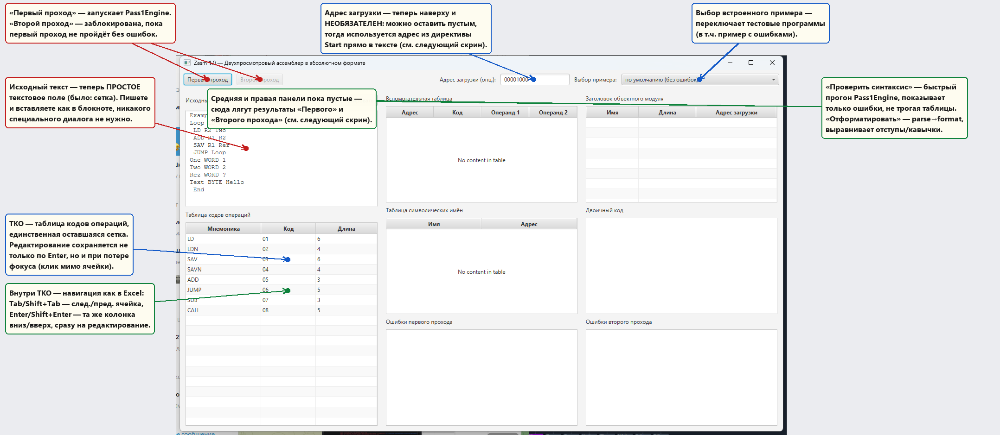
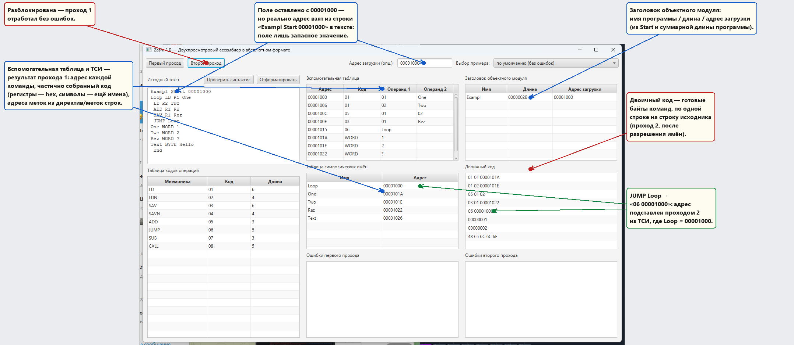
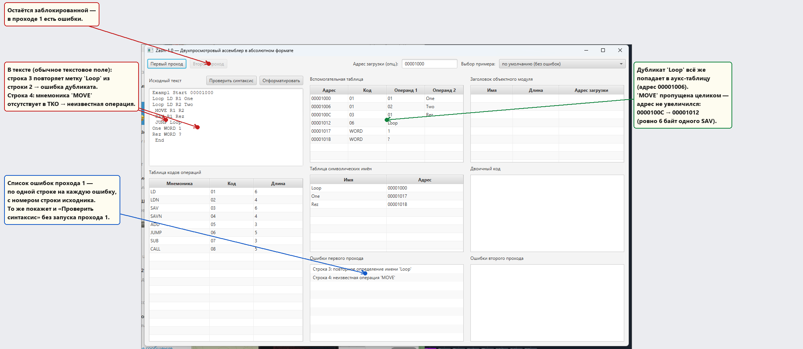

# Zasm — обзор работы программы (Этап 1)

Обзор того, как сейчас на самом деле работает приложение: архитектура,
алгоритм двух проходов ассемблера, разбор интерфейса по скриншотам с
указателями на элементы.

Актуально на текущее состояние ветки (Этап 1 методички: абсолютный формат,
проход 1 и проход 2 реализованы, интерфейс ввода — обычное текстовое поле
+ одна редактируемая таблица кодов операций; Этапы 2–3 — перемещаемый
формат и раздельное ассемблирование — из `docs/plans/zasm-plan.md` пока не
начаты).

---

## 1. Что это за программа

Zasm — учебный визуализатор работы двухпроходного ассемблера (задание по
методичке, `docs/labs/img.png` + `img_1.png`, стиль интерфейса — по
скриншотам эталонной Delphi-программы `img_2.jpg…img_7.jpg`). Пользователь
пишет программу для абстрактного процессора (8 команд, 4 регистра) обычным
текстом, по кнопке запускает проход 1 (вычисление адресов и таблицы имён) и
проход 2 (генерация машинного кода), и видит все промежуточные структуры
данных классического ассемблера — вспомогательную таблицу, таблицу
символических имён (ТСИ), итоговый бинарный код и списки ошибок каждого
прохода.

Технологии: **Kotlin + JavaFX** (UI собран программно, без FXML),
Gradle 9.6, JUnit 5 для движка. Подробности стека и историю решений см.
`docs/plans/zasm-plan.md`.

---

## 2. Архитектура

```
org.slavacom.zasm
├── model/    доменные классы + утилиты: SourceLine, OpcodeEntry, AuxTableRow,
│             SymbolTableEntry, ObjectHeader, AssemblerError, InstructionFormat,
│             HexUtils (parseHex/toHex*), SourceTextParser (парсер текста программы)
├── engine/   Pass1Engine, Pass2Engine — чистый Kotlin, без JavaFX, юнит-тестируемый;
│             AssemblerEngine — держит результат прохода 1 между кликами кнопок
├── samples/  Stage1Samples — 2 встроенных примера для ComboBox «Выбор примера»
└── ui/       MainApp (JavaFX Application) + StringGrid (редактор таблиц)
```

Ключевое архитектурное решение: **движок не знает о JavaFX**. `MainApp`
только читает текст из `TextArea`/данные из `StringGrid`, вызывает
`AssemblerEngine.runPass1()`/`runPass2()` и заливает результат обратно в
таблицы — никакой бизнес-логики в обработчиках кнопок (`MainApp.kt`). Это
позволяет тестировать алгоритм ассемблера (`Pass1EngineTest`,
`Pass2EngineTest`, `SourceTextParserTest`) без запуска графики.

`AssemblerEngine` (`engine/AssemblerEngine.kt`) — простой держатель
состояния: `runPass1()` сохраняет результат в `lastPass1`, `runPass2()`
требует, чтобы `lastPass1` уже был посчитан. Кнопка «Второй проход» в UI
физически блокируется до успешного прохода 1, но если после прохода 1
пользователь правит текст и жмёт «Второй проход» повторно без нового
«Первого прохода» — движок молча использует устаревший `lastPass1`. Это
осознанное упрощение Этапа 1 (см. план, §5).

---

## 3. Модель процессора

Ровно 4 формата команды (`model/InstructionFormat.kt`) — сколько байт
занимает команда и какая адресация ей соответствует:

| Формат | Байты | Мнемоники | Адресация | Когда операнд разрешается |
|---|---|---|---|---|
| `REG_ADDR`   | opcode+reg+addr(4) = 6 | `LD`, `SAV`   | прямая | адрес — проходом 2 |
| `REG_OFFSET` | opcode+reg+offset(2) = 4 | `LDN`, `SAVN` | относительная (PC-relative) | смещение — проходом 2 |
| `ADDR_ONLY`  | opcode+addr(4) = 5 | `JUMP`, `CALL`| прямая | адрес — проходом 2 |
| `REG_REG`    | opcode+reg1+reg2 = 3 | `ADD`, `SUB`  | нет | не нужно — оба операнда известны уже на проходе 1 |

Таблица кодов операций (ТКО) в UI **редактируема** — можно поменять код или
длину существующей мнемоники прямо в таблице без пересборки; но
сопоставление «мнемоника → формат» (`instructionFormatOf`) зашито в коде,
поэтому добавить принципиально новую мнемонику через UI нельзя.

Псевдокоманды: `Start` (имя программы + опционально свой адрес загрузки,
см. §4.1), `End` (конец текста), `WORD` (4 байта, значение либо `?` — не
инициализировано), `BYTE` (строка → ASCII-байты). Метка, совпадающая с
любой мнемоникой или псевдокомандой (без учёта регистра), — ошибка.

---

## 4. Как работает интерфейс — по шагам, со скриншотами

Три панели, слева направо — вход, промежуточные структуры, результат:

- **Левая** — исходный текст (обычное текстовое поле) + ТКО.
- **Средняя** — вспомогательная таблица (проход 1) + ТСИ + ошибки прохода 1.
- **Правая** — заголовок объектного модуля + двоичный код + ошибки прохода 2.

Сверху, в общей панели инструментов — кнопки проходов, необязательный адрес
загрузки и выбор встроенного примера.

### 4.1 Начальное состояние



При запуске сразу подгружен пример «по умолчанию» — не нужно ничего вводить
руками, чтобы увидеть, как программа реагирует. Что изменилось по сравнению
с более ранней версией и на что стоит обратить внимание:

- **Исходный текст — обычное текстовое поле** (`TextArea`), а не сетка.
  Пишете и вставляете код как в блокноте; отдельный диалог «вставить текст»
  и специальная обработка Ctrl+V больше не нужны — их заменяет самый
  обычный ввод текста.
- **«Проверить синтаксис»** — лёгкий прогон `Pass1Engine`, который только
  показывает ошибки (или «Ошибок не найдено.»), не трогая вспомогательную
  таблицу/ТСИ и не разблокируя «Второй проход». Удобно проверить текст, не
  запуская полноценный проход 1.
- **«Отформатировать»** — разбирает текст (`parseSourceText`) и тут же
  печатает его обратно в канонической форме (`formatSourceText`):
  выравнивает отступы у безметочных строк, берёт в кавычки операнды с
  пробелами.
- **Адрес загрузки перенесён наверх и стал необязательным** — поле можно
  оставить пустым; тогда программа возьмёт адрес из директивы `Start` в
  самом тексте (подробности и приоритет — в §4.2 и §5).
- **«Второй проход» изначально неактивна** — физически заблокирована, пока
  проход 1 не отработает без ошибок.
- **ТКО осталась единственной таблицей** в интерфейсе — и её редактор
  переписан: правка ячейки сохраняется не только по Enter, но и при потере
  фокуса (клик мимо, переключение окна) — раньше в стандартном
  JavaFX-редакторе такая правка молча терялась. Внутри таблицы работает
  навигация как в Excel/Google Sheets: **Tab**/**Shift+Tab** — следующая/
  предыдущая ячейка (с переносом на соседнюю строку на границе),
  **Enter**/**Shift+Enter** — та же колонка в следующей/предыдущей строке,
  и сразу открывает её на редактирование, без повторного клика
  (`ui/StringGrid.kt`, `NavigableTextFieldCell`).
- Средняя и правая панели пустые — они сбрасываются при смене примера,
  чтобы не показывать результат для уже неактуального исходника.

### 4.2 Оба прохода выполнены успешно



После клика «Первый проход», затем «Второй проход»:

- **Вспомогательная таблица** — построчный результат прохода 1: адрес
  каждой команды/директивы, код операции, операнды. Регистровые операнды
  (`01` в столбце «Операнд 1» для `LD R1, One`) уже закодированы в hex на
  проходе 1, а символьный операнд (`One`, `Two`, `Rez`, `Loop`) остаётся
  текстом-именем — «частично сгенерированные команды» из методички:
  разрешить имена может только проход 2, когда вся ТСИ уже построена.
- **ТСИ** (таблица символических имён) — каждая метка и её абсолютный
  адрес, вычисленный проходом 1 по мере обхода текста.
- Поле «Адрес загрузки» показывает `00001000` — но это лишь совпадение со
  значением по умолчанию. Реально адрес взят из строки `Exampl Start
  00001000` в самом тексте: директива `Start` со своим операндом-адресом
  **имеет приоритет** над полем ввода. Можно стереть поле полностью — при
  наличии адреса в `Start` результат не изменится (см. §5).
- После «Второго прохода»: **заголовок объектного модуля** (имя программы
  из `Start`, суммарная длина, адрес загрузки) и **двоичный код** — готовые
  байты, по одной строке двоичного кода на одну строку исходника.
- Зелёная стрелка показывает конкретный пример разрешения имени: команда
  `JUMP Loop` на проходе 1 сохранила код `06` и текст `Loop`; проход 2
  нашёл `Loop = 00001000` в ТСИ и подставил его — итоговая строка
  `06 00001000`.

### 4.3 Проход 1 с ошибками



Второй встроенный пример нарочно содержит две типичные ошибки —
переключается через тот же ComboBox «Выбор примера»:

- **Дубликат метки** — вторая строка с меткой `Loop` конфликтует с первой;
  `Pass1Engine.defineSymbol` находит имя уже занятым и добавляет ошибку
  «повторное определение имени», но **не прерывает обработку** — строка
  всё равно попадает во вспомогательную таблицу (адрес `00001006` в
  примере), только не добавляется в ТСИ повторно.
- **Неизвестная операция** — мнемоники `MOVE` нет в ТКО; ошибка
  «неизвестная операция», и в этом случае строка **вообще не порождает**
  запись во вспомогательной таблице, а адрес не увеличивается — заметно по
  скачку `0000100C → 00001012` (ровно 6 байт одного `SAV`, `MOVE`
  пропущен целиком, а не занял место с нулевой длиной).
- Список ошибок — по одной строке на ошибку, с номером строки исходного
  текста (`AssemblerError(line, message)`). Точно такой же список выдаст
  и кнопка **«Проверить синтаксис»**, не запуская сам проход.
- **«Второй проход» остаётся заблокированной** — это единственное видимое
  следствие ошибок для пользователя, кроме самого списка.

---

## 5. Алгоритм внутри

### Проход 1 (`engine/Pass1Engine.kt`)

Один линейный проход по строкам источника, `address` стартует от адреса
загрузки:

1. Метка строки (если есть) → проверка на зарезервированное слово и на
   дубликат → запись в ТСИ на текущий `address`.
2. Директива `Start` → запоминает имя программы (метка строки); если у неё
   указан операнд-адрес (`Exampl Start 00001000`) — этот адрес **разрешает
   и переопределяет** значение поля «Адрес загрузки» из UI. Если операнд
   пуст, используется адрес из поля; если пусты оба — ошибка «не указан
   адрес загрузки (ни в поле, ни в Start)». Некорректный hex в операнде
   `Start` — отдельная ошибка «некорректный адрес в директиве Start».
3. `WORD`/`BYTE` → длина 4 либо длина строки, запись «как есть» во
   вспомогательную таблицу, `address += длина`.
4. Известная мнемоника → кодирование того, что можно закодировать сразу
   (регистры — в hex по таблице форматов), символьный операнд оставляется
   текстом; `address += length` из ТКО.
5. Неизвестная мнемоника (и не директива) → ошибка, адрес не увеличивается.

Три сценария адреса загрузки покрыты тестами `Pass1EngineTest`: адрес
только из `Start` (поле пусто), `Start` переопределяет непустое поле, и
ошибка при отсутствии обоих.

### Проход 2 (`engine/Pass2Engine.kt`)

Проходит уже готовую вспомогательную таблицу, а не исходный текст:

1. Для каждой строки находит формат по коду операции в (актуальной) ТКО.
2. Символьный операнд ищется в ТСИ; для прямой адресации (`REG_ADDR`,
   `ADDR_ONLY`) подставляется абсолютный адрес; для относительной
   (`REG_OFFSET`) считается `target - адрес_следующей_команды`
   (PC-relative — поэтому такая команда не потребует таблицы настройки
   при перемещении модуля в Этапе 2).
3. Имя не найдено ни там → ошибка «не определено имя».
4. `WORD`/`BYTE` кодируются напрямую (`WORD ?` не даёт строки дампа).

---

## 6. Редактор таблицы кодов операций

ТКО — единственная оставшаяся в интерфейсе таблица, и её ячейки используют
собственный редактор (`ui/StringGrid.kt`, класс `NavigableTextFieldCell`)
вместо стандартного `TextFieldTableCell` из JavaFX, у которого есть два
неудобства: правка не сохраняется при потере фокуса (только по Enter), и
нет клавиатурной навигации между ячейками.

Реализовано:

- **Сохранение по потере фокуса** — слушатель на `focusedProperty` поля
  редактирования вызывает `commitEdit`, если фокус ушёл во время
  редактирования (клик по другой ячейке/кнопке/окну).
- **Tab / Shift+Tab** — переход к следующей/предыдущей ячейке той же
  строки; на границе строки — перенос на первую/последнюю ячейку соседней
  строки.
- **Enter / Shift+Enter** — переход к той же колонке в следующей/
  предыдущей строке.
- В обоих случаях новая ячейка сразу открывается на редактирование
  (`TableView.edit(row, column)` через `Platform.runLater`), без повторного
  клика мышью.
- **Escape** — отменяет правку текущей ячейки, возвращая исходное
  значение.

---

## 7. Известные ограничения (сознательные, не баги)

- Формат команды жёстко привязан к конкретной мнемонике
  (`instructionFormatOf`) — правка кода/длины в ТКО поддержана, замена
  набора команд на принципиально другой — нет.
- «Второй проход» не блокируется автоматически, если исходный текст
  поправили после успешного прохода 1 без повторного запуска первого —
  движок использует последний сохранённый результат.
- Реализован только Этап 1 методички (абсолютный формат). Этап 2
  (перемещаемый формат, таблица настройки) и Этап 3 (`EXTDEF`/`EXTREF`,
  раздельное ассемблирование, сохранение в файл) — по плану
  `docs/plans/zasm-plan.md`, не начаты.

---

## 8. Как запустить самому

```bash
./gradlew run     # обычный запуск, пример по умолчанию
./gradlew test    # юнит-тесты движка (Pass1/Pass2/Parser)
```
